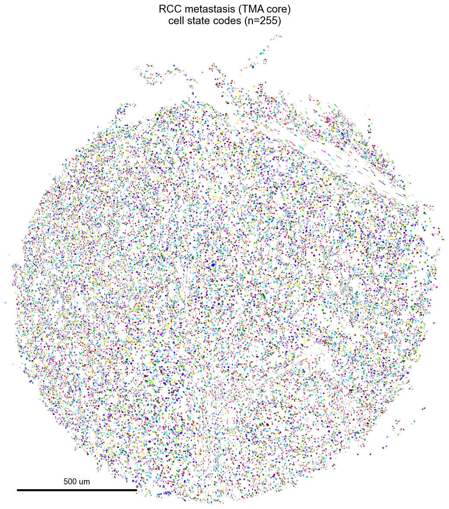
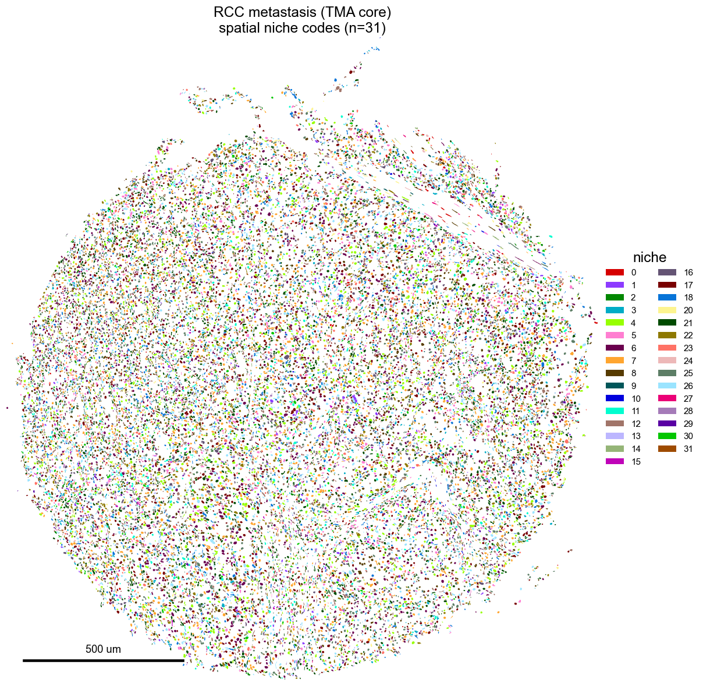
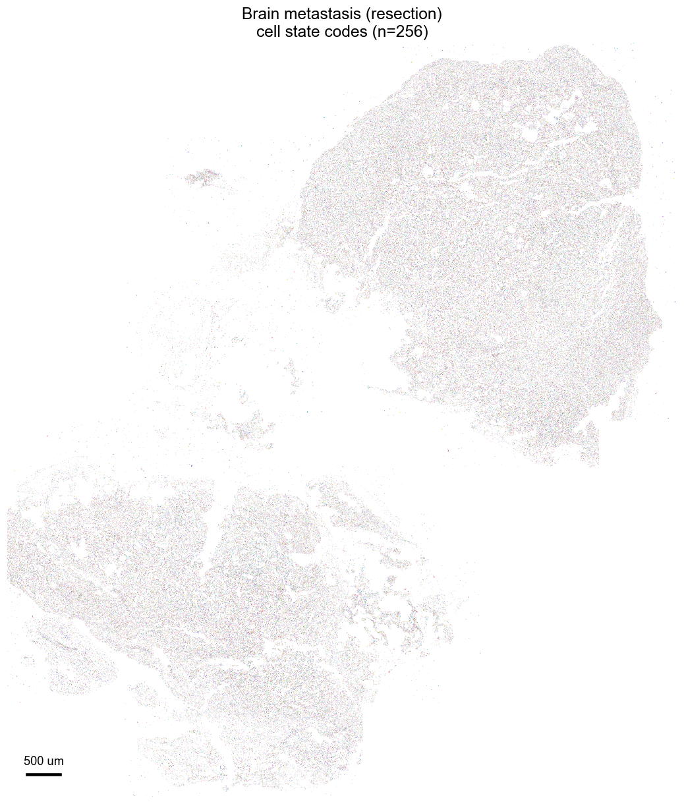
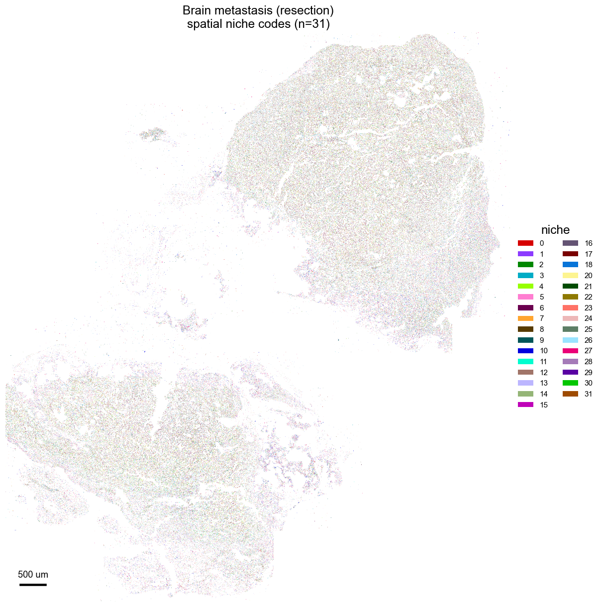

# Gallery

```{raw} html
<div class="bb-marquee reveal" aria-hidden="true">
  <div class="bb-marquee-track">
    
    
    
    
    
    
    
    
    
    
  </div>
</div>
```

```{raw} html
<div class="bb-explore">

  <div class="bb-explore-header reveal">
    <h2>Explore the collection</h2>
    <p class="bb-explore-lead">The same frozen NICHEVERSE model, run across published imaging-based spatial
    transcriptomics datasets from every accessible platform (Xenium, CosMx, MERFISH, seqFISH, RIBOmap,
    EEL-FISH) and tissue. Each map paints one dataset's cells at their nuclear centroids, colored by the
    lineage annotation of their learned cell-state code. Filter by cancer, normal, developmental, or disease,
    pick a tissue site, or search by site or cell type.</p>
  </div>

  <div class="bb-controls">
    <div class="bb-count" id="bb-count"><b>&hellip;</b> datasets</div>

    <input class="bb-search" id="bb-search" type="search" placeholder="Search site or cell type (e.g. tonsil, macrophage)" aria-label="Search datasets">

    <div class="bb-chips" id="bb-chips" role="group" aria-label="Filter by category">
      <button class="bb-chip is-active" data-filter="all">All</button>
      <button class="bb-chip" data-filter="Cancer">Cancer</button>
      <button class="bb-chip" data-filter="Normal">Normal</button>
      <button class="bb-chip" data-filter="Developmental">Developmental</button>
      <button class="bb-chip" data-filter="Disease">Disease</button>
    </div>

    <select class="bb-select" id="bb-site" aria-label="Filter by tissue site">
      <option value="all">All sites</option>
    </select>

    <select class="bb-select" id="bb-platform" aria-label="Filter by platform">
      <option value="all">All platforms</option>
    </select>

    <div class="bb-viewtoggle" id="bb-viewtoggle" role="group" aria-label="Columns">
      <span class="bb-vlabel">View</span>
      <button class="bb-view" data-cols="2" aria-label="Two columns">2</button>
      <button class="bb-view is-active" data-cols="3" aria-label="Three columns">3</button>
      <button class="bb-view" data-cols="4" aria-label="Four columns">4</button>
    </div>
  </div>

  <div class="bb-grid" id="bb-grid" data-cols="3" data-gallery-src="../_static/gallery_data.json"></div>

  <p class="bb-explore-lead" style="margin-top:1.8rem">Each map is produced by loading the released checkpoint,
  running <code>nicheverse.predict_codes</code> on the dataset, annotating every cell-state code with a
  literature-grounded cell type, and coloring each cell by the lineage of its code. The catalogue and the
  full-resolution vector maps are regenerated automatically as new datasets are added.</p>

</div>
```
