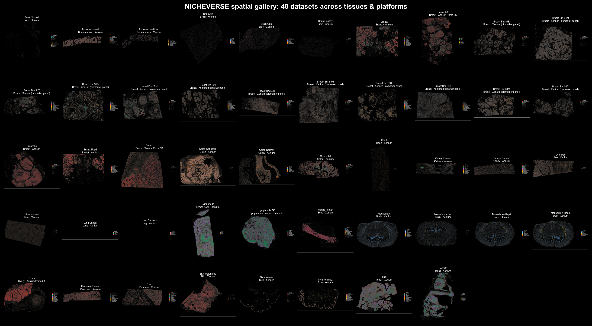
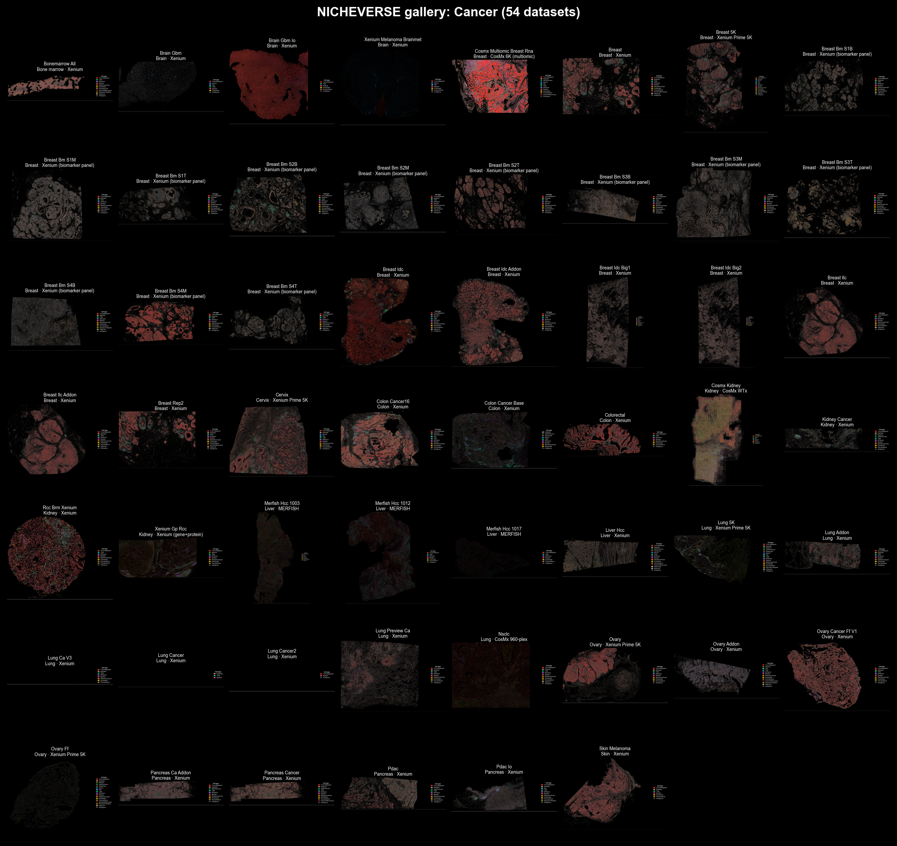
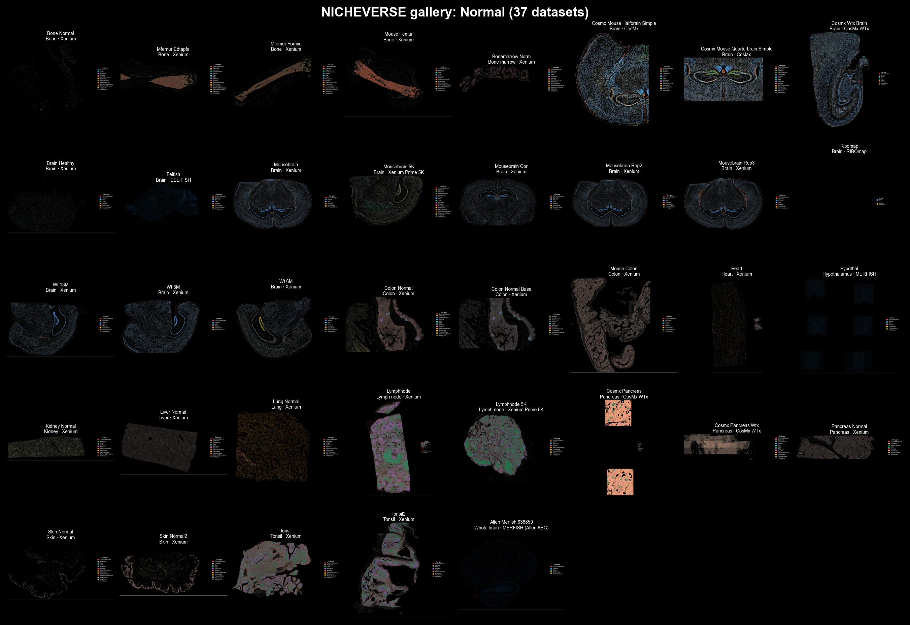

# Gallery

```{raw} html
<div class="gx">

  <header class="gx-hero reveal">
    <span class="gx-eyebrow">Spatial atlas</span>
    <h2 class="gx-title">One model, read across every tissue.</h2>
    <p class="gx-lead">The released NICHEVERSE checkpoint &mdash; frozen, never retrained &mdash; run across
      published imaging-based spatial transcriptomics datasets from every accessible platform. Every cell is
      painted by the lineage of the cell-state code the model assigns it.</p>
    <div class="gx-spectrum" title="each hue is a cell-type lineage" aria-hidden="true"></div>
    <p class="gx-spectrum-cap">each hue is a cell-type lineage &mdash; the same key colors every map below</p>
    <dl class="gx-stats" id="gx-stats" aria-label="Atlas totals">
      <div class="gx-stat"><dt>datasets</dt><dd id="gx-n-datasets">&mdash;</dd></div>
      <div class="gx-stat"><dt>tissues</dt><dd id="gx-n-sites">&mdash;</dd></div>
      <div class="gx-stat"><dt>platforms</dt><dd id="gx-n-plat">&mdash;</dd></div>
      <div class="gx-stat"><dt>cells mapped</dt><dd id="gx-n-cells">&mdash;</dd></div>
    </dl>
  </header>

  <section class="gx-overview reveal">
    <h3 class="gx-h3">At a glance</h3>
    <figure class="gx-ovfig gx-ovfig--wide">
      
      <figcaption>Every rendered dataset</figcaption>
    </figure>
    <div class="gx-ovrow">
      <figure class="gx-ovfig"><figcaption>Cancer</figcaption></figure>
      <figure class="gx-ovfig"><figcaption>Normal</figcaption></figure>
    </div>
  </section>

  <section class="gx-explore">
    <div class="gx-explore-head reveal">
      <h3 class="gx-h3">Browse the atlas</h3>
      <p class="gx-sub">Filter by condition, tissue, or platform, or search a site or cell type.
        Each plate is one dataset&rsquo;s whole section; toggle the column count to open a plate up.</p>
    </div>

    <div class="gx-controls" id="gx-controls">
      <div class="bb-count" id="bb-count"><b>&hellip;</b> plates</div>
      <input class="bb-search" id="bb-search" type="search" placeholder="Search a site or cell type &mdash; tonsil, macrophage&hellip;" aria-label="Search datasets">
      <div class="bb-chips" id="bb-chips" role="group" aria-label="Filter by condition">
        <button class="bb-chip is-active" data-filter="all">All</button>
        <button class="bb-chip" data-filter="Cancer">Cancer</button>
        <button class="bb-chip" data-filter="Normal">Normal</button>
        <button class="bb-chip" data-filter="Developmental">Developmental</button>
        <button class="bb-chip" data-filter="Disease">Disease</button>
      </div>
      <select class="bb-select" id="bb-site" aria-label="Filter by tissue site"><option value="all">All tissues</option></select>
      <select class="bb-select" id="bb-platform" aria-label="Filter by platform"><option value="all">All platforms</option></select>
      <div class="bb-viewtoggle" id="bb-viewtoggle" role="group" aria-label="Columns">
        <span class="bb-vlabel">Zoom</span>
        <button class="bb-view" data-cols="1" aria-label="One column">1</button>
        <button class="bb-view is-active" data-cols="2" aria-label="Two columns">2</button>
        <button class="bb-view" data-cols="3" aria-label="Three columns">3</button>
        <button class="bb-view" data-cols="4" aria-label="Four columns">4</button>
      </div>
    </div>

    <div class="bb-grid" id="bb-grid" data-cols="2" data-gallery-src="../_static/gallery_data.json"></div>

    <p class="gx-method">Each plate is produced by loading the released checkpoint, running
      <code>nicheverse.predict_codes</code> on the dataset, annotating every cell-state code with a
      literature-grounded cell type, and coloring each cell by the lineage of its code. The catalogue and the
      full-resolution vector maps regenerate automatically as datasets are added.</p>
  </section>

</div>
```
