# NICHEVERSE

```{raw} html
<div class="nvh">
  <section class="nvh-hero">
    <div class="nvh-hero-copy">
      <span class="nvh-eyebrow">A world model for tissues</span>
      <h1 class="nvh-title">Every cell and niche mapped to an interpretable&nbsp;codebook.</h1>
      <div class="nvh-cta">
        <a class="nvh-btn" href="guides/gallery.html">Explore the atlas</a>
        <a class="nvh-btn nvh-btn--ghost" href="guides/quickstart.html">Get started</a>
      </div>
      <dl class="nv-homestats" id="nv-homestats" data-src="_static/gallery_data.json" aria-label="Atlas totals">
        <div class="nv-hs"><dd id="nv-hs-samples">381</dd><dt>samples</dt></div>
        <div class="nv-hs"><dd id="nv-hs-datasets">102</dd><dt>datasets</dt></div>
        <div class="nv-hs"><dd id="nv-hs-cells">39M</dd><dt>cells mapped</dt></div>
        <div class="nv-hs"><dd id="nv-hs-sites">20</dd><dt>tissues</dt></div>
        <div class="nv-hs"><dd id="nv-hs-plat">6</dd><dt>platforms</dt></div>
      </dl>
    </div>
    <figure class="nvh-hero-shot">
      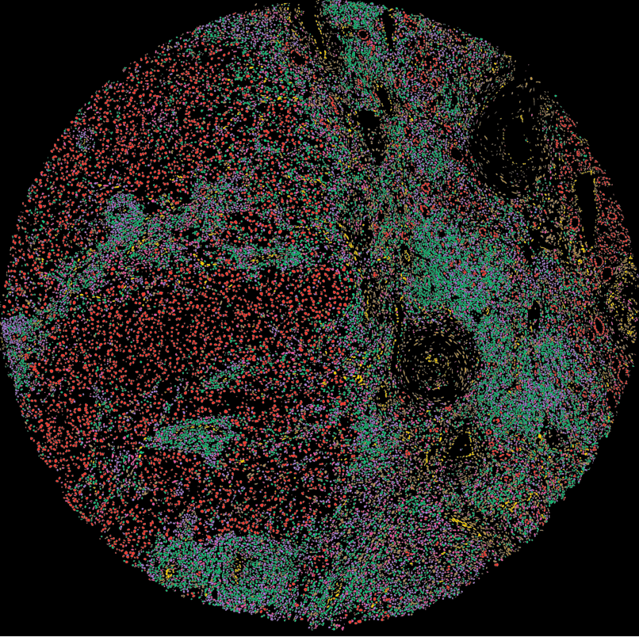
    </figure>
  </section>

  <section class="nvh-codebook">
    <figure class="nvh-cb-shot">
      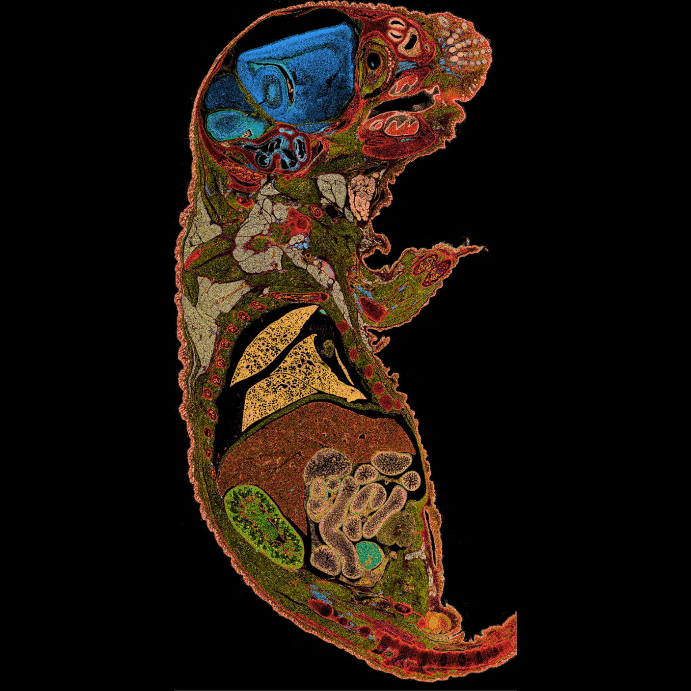
    </figure>
    <div class="nvh-cb-copy">
      <span class="nvh-eyebrow">Interpretable by construction</span>
      <h2 class="nvh-h2">A discrete code for every cell and niche.</h2>
      <p class="nvh-p">Each cell is quantized to one of <b>256 learned cell states</b> and each neighborhood to one of <b>32 spatial niches</b>, coupled by cross-attention so identity is always read in tissue context. The same discrete vocabulary transfers, unchanged, from one cohort and platform to the next.</p>
      <div class="nvh-cb-tags">
        <span class="nvh-tag"><b>256</b> cell-state codes</span>
        <span class="nvh-tag"><b>32</b> niche codes</span>
        <span class="nvh-tag">cross-attention coupled</span>
      </div>
    </div>
  </section>

  <section class="nvh-vocab">
    <div class="nvh-vocab-copy">
      <span class="nvh-eyebrow">Recovered, not supervised</span>
      <h2 class="nvh-h2">An interpretable vocabulary of cell states.</h2>
      <p class="nvh-p">Correlating the learned code embeddings blocks them into coherent lineages with no labels supplied, epithelium, stroma, endothelium, and the immune compartment separate on their own. Each code carries a stable expression signature you can read, name, and compare across tissues.</p>
    </div>
    <figure class="nvh-vocab-shot">
      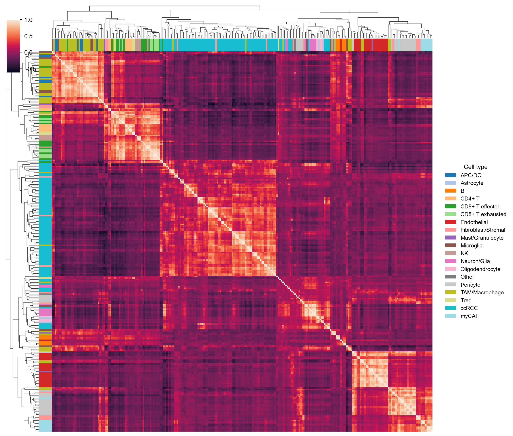
    </figure>
  </section>

  <section class="nvh-explore">
    <div class="nvh-circles" aria-hidden="true">
      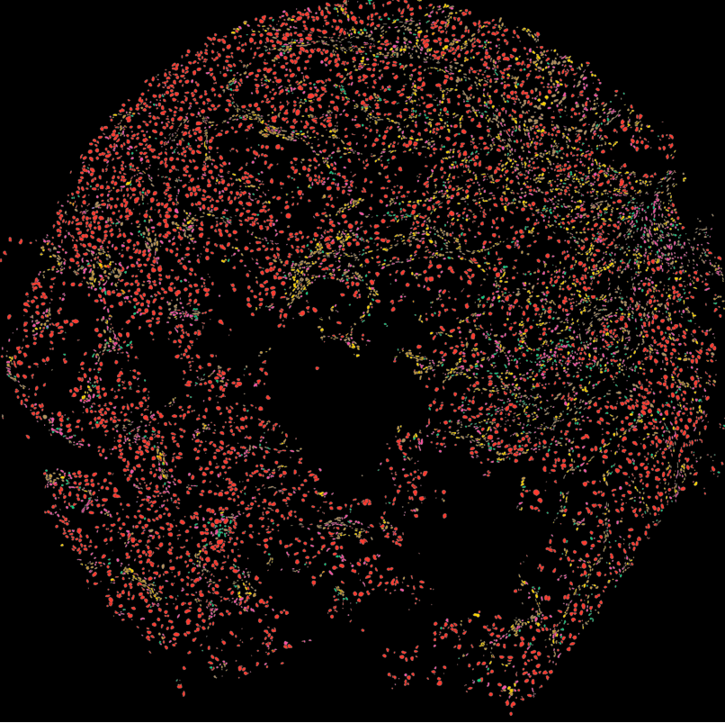
      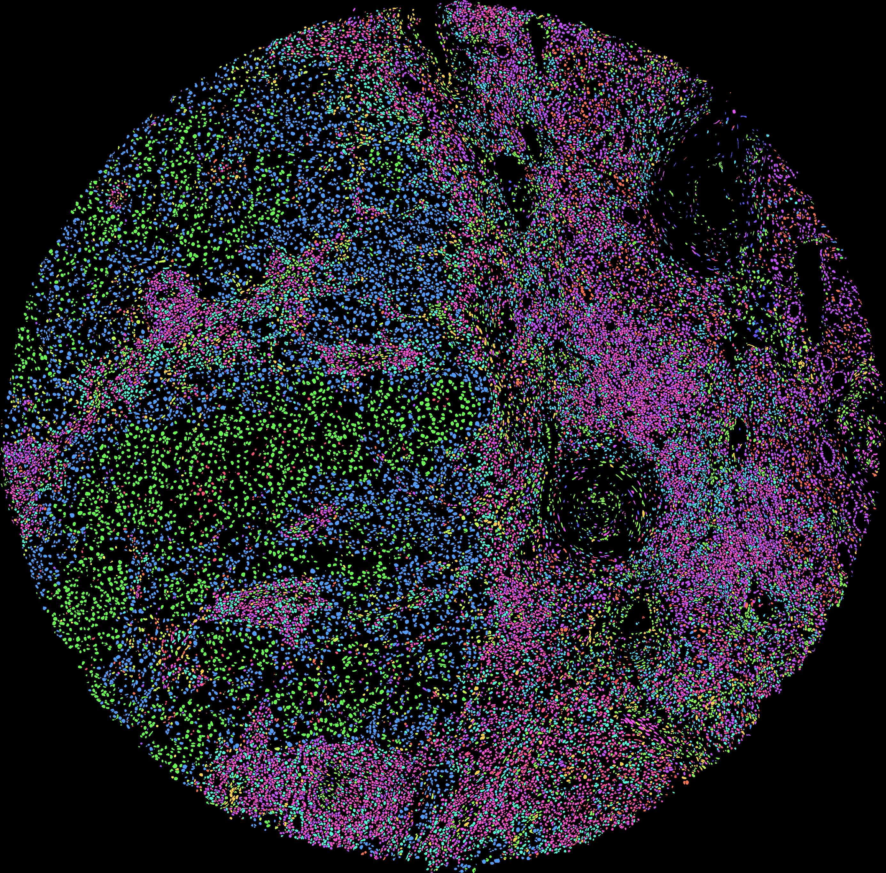
      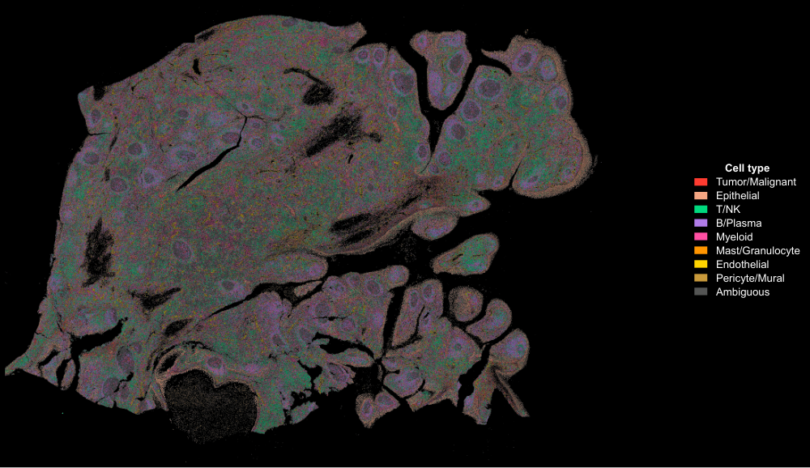
      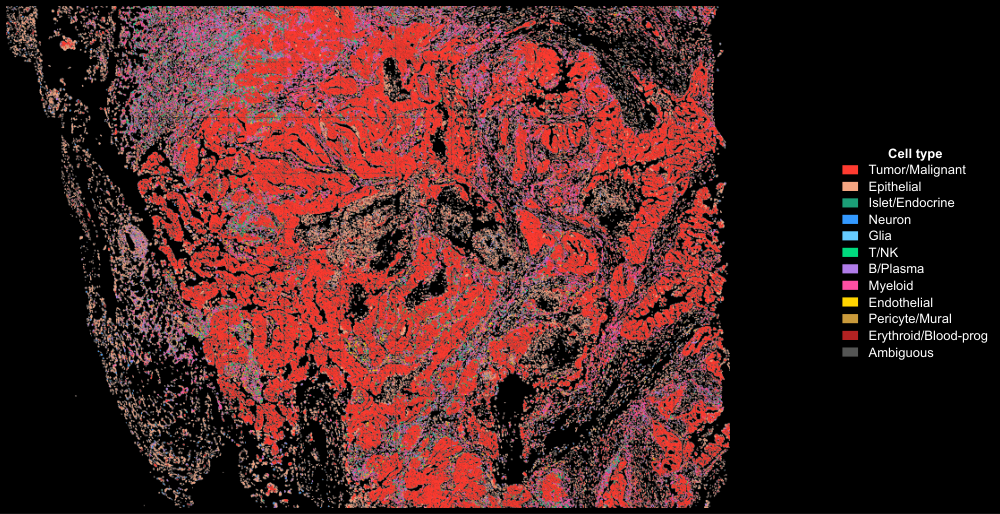
      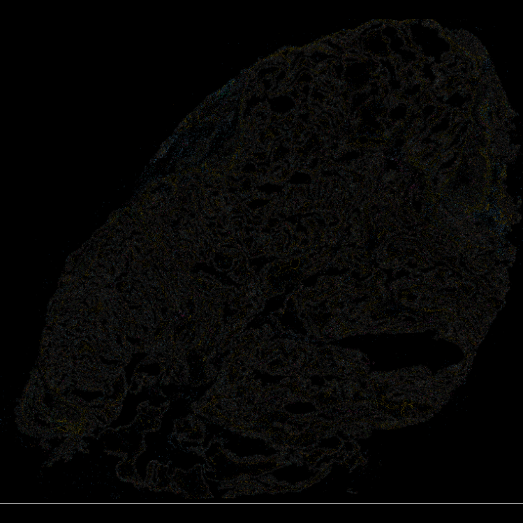
      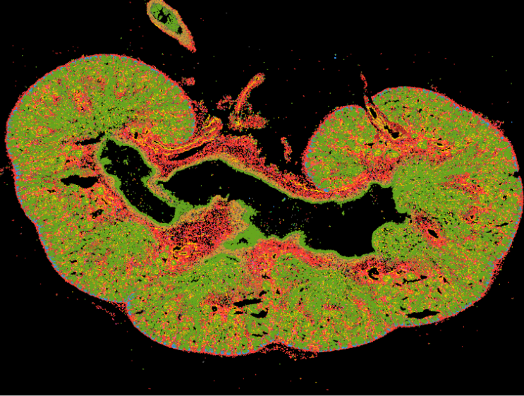
      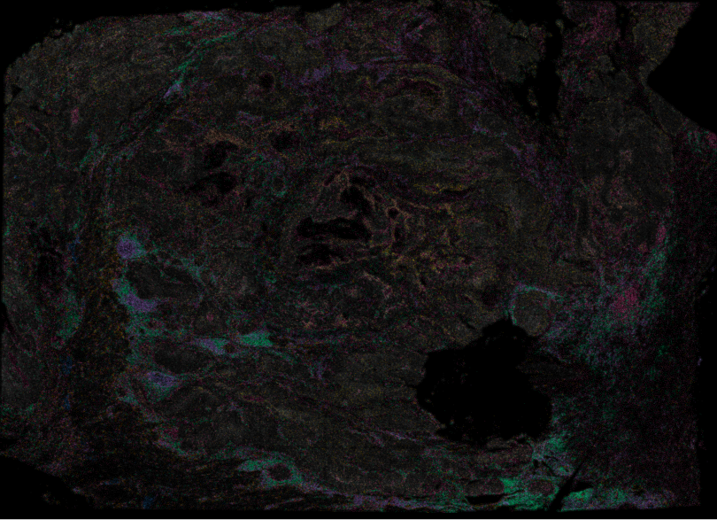
      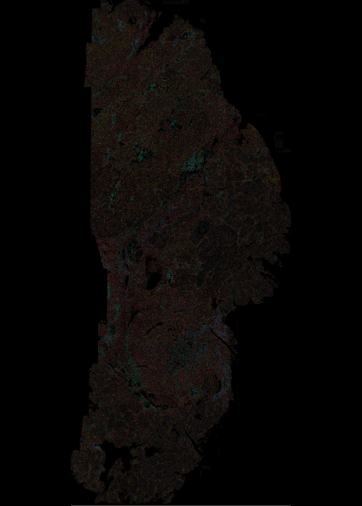
      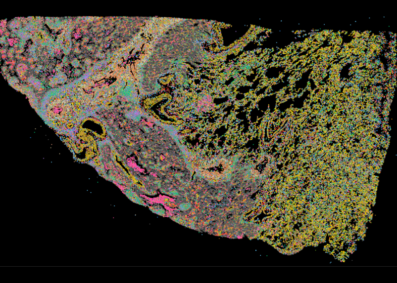
    </div>
    <div class="nvh-explore-copy">
      <h2 class="nvh-h2">Explore the atlases mapped in the nicheverse</h2>
      <p class="nvh-p">Read across <b>381 independent samples</b> from 102 datasets and every accessible platform, Xenium, CosMx, MERFISH, seqFISH, RIBOmap, EEL-FISH. Every cell is painted by the lineage of the cell-state code the model assigns it.</p>
      <a class="nvh-btn" href="guides/gallery.html">Browse all samples</a>
    </div>
  </section>

  <section class="nvh-wordmark" aria-label="NICHEVERSE">
    <h2 class="nvh-wm-mark">NICHEVERSE</h2>
    <p class="nvh-wm-exp"><b>N</b>eighborhood-<b>I</b>nferred <b>C</b>ell type <b>H</b>i<b>E</b>rarchical annotation + <b>VE</b>ctor-quantized <b>R</b>epresentations of <b>S</b>patial <b>E</b>cotypes</p>
    <p class="nvh-wm-desc">The released NICHEVERSE checkpoint, frozen and never retrained, learns paired discrete codebooks of recurrent cell states and multicellular spatial niches from imaging-based spatial transcriptomics, and reads any cohort reproducibly.</p>
  </section>
</div>
```

:::::{div} nvh-body

::::{grid} 1 2 2 3
:gutter: 3
:class-container: nv-features reveal

:::{grid-item-card} Hierarchical codebooks
Paired cell-state and spatial-niche codebooks coupled by cross-attention, so cell identity is read in tissue context.
:::
:::{grid-item-card} Swappable components
Encoder registry: `mlp_deep` (default), `mlp`, `mlp_plr`, `residual_mlp`, `transformer`, `cnn`, `fast_cnn`, `deep_cnn`, `gnn`, `diffusion`, `dit`, `set_transformer`, `perceiver_io`, `soft_moe`, `ft_transformer`. Quantizer registry: `vq` (default), `rvq`, `grvq`, `pq`, `qinco`, `rot`, `soft`, `bsq`, `lfq`, `fsq`, `residual_fsq`.
:::
:::{grid-item-card} Spatial-aware
Per-sample graphs (`knn`, `knn_radius`, `radius`, `delaunay`, `alpha_complex`, `gabriel`, `rng`), inverse-distance aggregation, and opt-in spatial-coherence losses.
:::
:::{grid-item-card} Reproducible
Byte-exact reproduction of the published renal cell carcinoma and brain-metastasis model, guarded by a regression test.
:::
:::{grid-item-card} PyTorch-native
A `Trainer`, checkpoints, mixed precision, warmup-cosine scheduling, and MAE pretraining.
:::

::::

{.reveal}
## Install

```bash
pip install nicheverse       # or: conda install -c conda-forge nicheverse
```

{.reveal}
## Quickstart

```python
import nicheverse as nv

adata = nv.read_xenium_cohort(["./run_A", "./run_B"])
mc = nv.ModelConfig(input_dim=adata.n_vars, gene_names=tuple(adata.var_names))
model, adata = nv.Trainer(nv.TrainConfig(num_epochs=300)).fit(adata, "./ckpt", model_config=mc)

annotated = nv.predict_codes(
    nv.read_xenium_cohort(["./run_C"]), "./ckpt/hierarchical_vqvae_checkpoint.pt"
)
```

:::::

```{toctree}
:hidden:
:maxdepth: 1
:caption: Getting started

guides/installation
guides/gallery
```

```{toctree}
:hidden:
:maxdepth: 2
:caption: API

api
```

```{toctree}
:hidden:
:maxdepth: 1
:caption: Guides

guides/quickstart
guides/method
guides/io
guides/hyperparameters
guides/annotation
guides/mcp
```

```{toctree}
:hidden:
:maxdepth: 1
:caption: Reproducibility

reproducibility/bundle
reproducibility/reviewer_recipe
reproducibility/determinism
```

```{toctree}
:hidden:
:maxdepth: 1
:caption: Project

changelog
contributing
```
