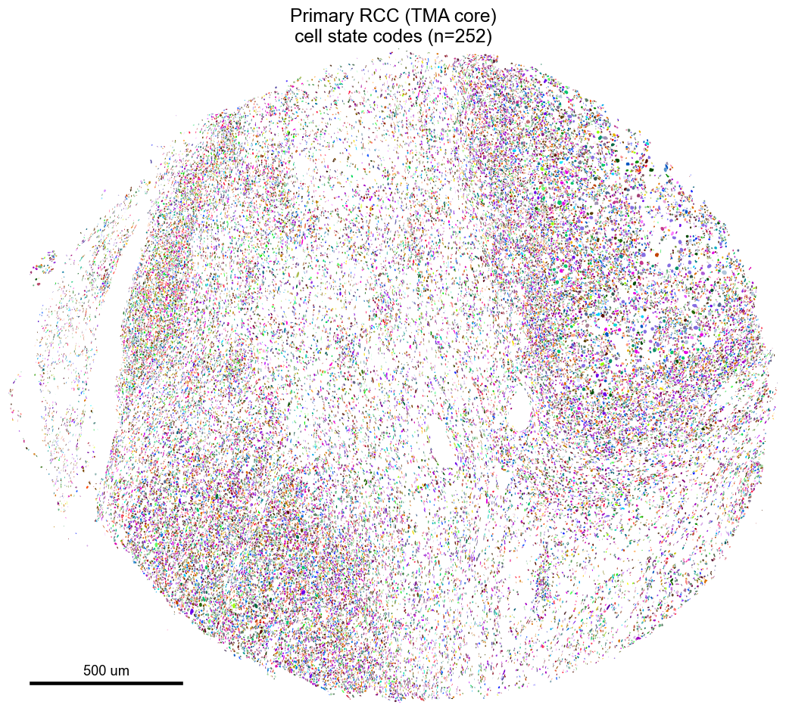
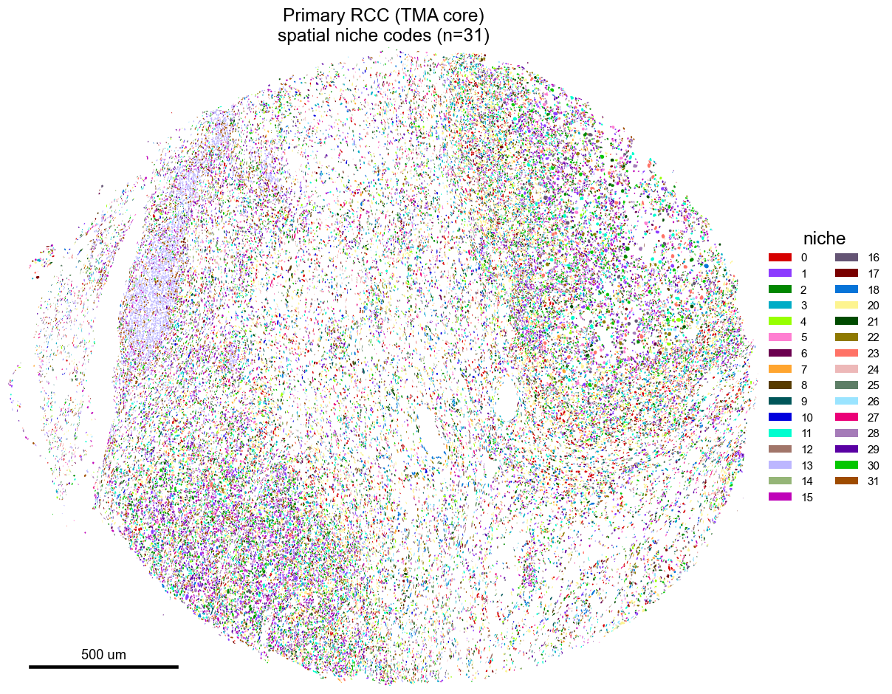

# NICHEVERSE

:::::{div} landing-hero
::::{div} hero-copy
<h1 class="hero-title">NICHEVERSE</h1>
<p class="hero-tagline">Neighborhood-Inferred Cell type HiErarchical annotation + VEctor-quantized Representations of Spatial Ecotypes</p>
<p class="hero-lead">A PyTorch world model for tissues: it learns paired discrete codebooks of recurrent cell states and multicellular spatial niches from imaging-based spatial transcriptomics (Xenium, MERFISH, seqFISH, CosMx), and annotates any cohort reproducibly.</p>

```{button-ref} guides/quickstart
:ref-type: doc
:color: primary
:class: hero-btn
Get started
```
```{button-ref} api
:ref-type: doc
:color: primary
:outline:
:class: hero-btn
API reference
```
::::

::::{div} hero-media
<div class="hero-anim"><span class="ha-cap"><b class="c1">256 cell states</b><b class="c2">32 spatial niches</b></span></div>
<span class="hero-media-cap">The model resolves the same renal cell carcinoma core into cell states, then spatial niches</span>
::::
:::::

::::{grid} 1 2 2 3
:gutter: 3
:class-container: nv-features reveal

:::{grid-item-card} Hierarchical codebooks
Paired cell-state and spatial-niche codebooks coupled by cross-attention, so cell identity is read in tissue context.
:::
:::{grid-item-card} Swappable components
Encoder registry: `mlp_deep` (default) / `mlp` / `mlp_plr` / `residual_mlp` / `transformer` / `cnn` / `fast_cnn` / `deep_cnn` / `gnn` / `diffusion` / `dit` / `set_transformer` / `perceiver_io` / `soft_moe` / `ft_transformer`. Quantizer registry: `vq` (default) / `rvq` / `grvq` / `pq` / `qinco` / `rot` / `soft` / `bsq` / `lfq` / `fsq` / `residual_fsq`.
:::
:::{grid-item-card} Spatial-aware
Per-sample graphs (`knn`, `knn_radius` default at 50 microns, `radius`, `delaunay`, `alpha_complex`, `gabriel`, `rng`), inverse-distance aggregation, and opt-in spatial-coherence losses.
:::
:::{grid-item-card} Count-native
Default negative-binomial cell likelihood with a detection hurdle and a Dirichlet-multinomial niche composition term on raw counts, plus transcript-level subcellular context.
:::
:::{grid-item-card} Reproducible
Byte-exact reproduction of the published renal cell carcinoma and brain-metastasis model, guarded by a regression test.
:::
:::{grid-item-card} PyTorch-native
A `Trainer`, checkpoints, mixed precision, warmup-cosine scheduling, and MAE pretraining.
:::

::::

{.reveal}
## Install

```bash
pip install nicheverse       # or: conda install -c conda-forge nicheverse
```

{.reveal}
## Quickstart

```python
import nicheverse as nv

adata = nv.read_xenium_cohort(["./run_A", "./run_B"])
mc = nv.ModelConfig(input_dim=adata.n_vars, gene_names=tuple(adata.var_names))
model, adata = nv.Trainer(nv.TrainConfig(num_epochs=300)).fit(adata, "./ckpt", model_config=mc)

annotated = nv.predict_codes(
    nv.read_xenium_cohort(["./run_C"]), "./ckpt/hierarchical_vqvae_checkpoint.pt"
)
```

{.reveal}
## Spatial niches, learned

Niche codes rendered on nuclear boundaries across renal cell carcinoma contexts. See the [full gallery](guides/gallery).

::::{grid} 1 3 3 3
:gutter: 3
:class-container: nv-gallery reveal

:::{grid-item-card} Primary RCC

:::
:::{grid-item-card} Metastasis

:::
:::{grid-item-card} Brain metastasis

:::

::::

```{toctree}
:hidden:
:maxdepth: 1
:caption: Getting started

guides/installation
guides/gallery
```

```{toctree}
:hidden:
:maxdepth: 2
:caption: API

api
```

```{toctree}
:hidden:
:maxdepth: 1
:caption: Guides

guides/quickstart
guides/method
guides/io
guides/hyperparameters
guides/annotation
guides/mcp
```

```{toctree}
:hidden:
:maxdepth: 1
:caption: Reproducibility

reproducibility/bundle
reproducibility/reviewer_recipe
reproducibility/determinism
```

```{toctree}
:hidden:
:maxdepth: 1
:caption: Project

changelog
contributing
```
